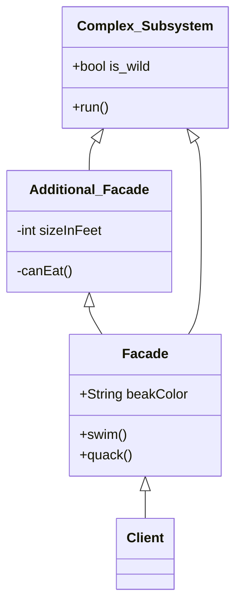

# Facade

## Intent
>패턴의 의도는 문제와 솔루션을 간략하게 설명합니다.

Facade는 라이브러리, 프레임워크 또는 기타 복잡한 클래스 집합에 대한 단순화된 인터페이스를 제공하는 structural design pattern입니다.
Provides a simplified interface to a library, a framework, or any other complex set of classes.
라이브러리, 프레임워크 또는 기타 복잡한 클래스 집합에 대한 단순화된 인터페이스를 제공합니다.

## Motivation
>동기 부여는 문제와 패턴이 가능하게 하는 솔루션을 추가로 설명합니다.

## Structure of classes
>클래스의 구조는 패턴의 각 부분과 어떻게 관련되어 있는지 보여줍니다.

 - Facade는 하위 시스템 기능의 특정 부분에 대한 편리한 액세스를 제공합니다. 클라이언트의 요청을 어디로 보내야 하는지, 움직이는 모든 부품을 어떻게 작동해야 하는지 알고 있습니다.

Additional Facade 클래스는 관련 없는 기능으로 단일 외관을 오염시켜 또 다른 복잡한 구조를 만들 수 있는 것을 방지하기 위해 생성할 수 있습니다. Additional Facade는 클라이언트와 다른 Facade 모두에서 사용할 수 있습니다.

Complex Subsystem은 수십 개의 다양한 객체로 구성됩니다. 그들 모두가 의미 있는 일을 하도록 하려면 올바른 순서로 개체를 초기화하고 적절한 형식의 데이터를 제공하는 것과 같은 하위 시스템의 구현 세부 정보를 자세히 살펴봐야 합니다.

Subsystem 클래스는 Facade의 존재를 인식하지 못합니다. 그들은 시스템 내에서 작동하고 서로 직접 작동합니다.

는 서브시스템 개체를 직접 호출하는 대신 Facade를 사용합니다.

## Applicability

(1) 복잡한 서브 시스템에 대한 제한적이지만 간단한 인터페이스가 필요한 경우 Facade Pattern을 사용하십시오
종종 서브시스템은 시간이 지남에 따라 더 복잡해집니다. Design Pattern을 적용해도 일반적으로 더 많은 클래스가 생성됩니다. 서브 시스템은 다양한 상황에서 더 유연해지고 더 쉽게 재사용할 수 있지만 크라이언트에서 요구하는 구성 및 상용구 코드의 양은 점점 더 커집니다. Facade는 대부분의 클라이언트 요구 사항에 맞는 서브시스템의 가장 많이 사용되는 기능에 대한 바로 가기를 제공하여 이 문제를 해결하려고 시도합니다.

(2) 서브시스템을 계층으로 구성하려는 경우 Facade를 사용하십시오
서브시스템의 각 레벨에 대한 진입점을 정의하기 위해 파사드를 작성하십시오. 파사드를 통해서만 통신하도록 요구함으로써 여러 서브시스템간의 결합을 줄일 수 있습니다.
예를 들어 비디오 변환 프레임워크로 돌아가 보겠습니다. 비디오 및 오디오 관련의 두 가지 계층으로 나눌 수 있습니다. 각 레이어에 대해 파사드를 만든 다음 각 레이어의 클래스가 해당 파사드를 통해 서로 통신하도록 할 수 있습니다. 이 접근 방식은 Mediator 패턴과 매우 유사해 보입니다.

## Java Library

• javax.faces.context.FacesContext uses 'LifeCycle', ViewHandler,NavigationHandler classes under the hood, but most clients aren’t aware of that.
• javax.faces.context.ExternalContext uses ServletContext, HttpSession, HttpServletRequest,HttpServletResponse

## Code example
>인기 있는 프로그래밍 언어 중 하나의 코드 예제를 사용하면 패턴 이면의 아이디어를 더 쉽게 파악할 수 있습니다.

1) 복잡한 비디오 변환 라이브러리를 위한 간단한 인터페이스**
이 예에서 Facade는 복잡한 비디오 변환 프레임워크와의 통신을 단순화합니다.
Facade는 프레임워크의 올바른 클래스를 구성하고 올바른 형식으로 결과를 검색하는 모든 복잡성을 처리하는 단일 메서드로 단일 클래스를 제공합니다.

2) 레트토핏 

## Releations with Other Patterns

Facade는 기존 개체에 대한 새 인터페이스를 정의하는 반면 Adapter는 기존 인터페이스를 사용 가능하게 만들려고 합니다. Adapter는 일반적으로 하나의 개체만 Wrapping하는 반면 Facade는 개체의 전체 하위 시스템과 함께 작동합니다.

Abstract Factory는 클라이언트 코드에서 서브시스템 객체가 생성되는 방식만 숨기고 싶을 때 Facade의 대안으로 사용할 수 있습니다.

Flyweight는 많은 작은 개체를 만드는 방법을 보여주는 반면 Facade는 전체 서브시스템을 나타내는 단일 개체를 만드는 방법을 보여 줍니다.

Facade와 Mediator는 비슷한 역할을 합니다. 밀접하게 연결된 많은 클래스 간의 협업을 구성하려고 합니다.

Facade는 객체의 서브시스템에 대한 단순화된 인터페이스를 정의하지만 새로운 기능을 도입하지는 않습니다. 서브시스템 자체는 Facade를 인식하지 못합니다. 서브시스템 내의 개체는 직접 통신할 수 있습니다.

Mediator는 시스템 구성 요소간의 통신을 중앙 집중화 합니다. 구성 요소는 Mediator 개체에 대해서만 알고 직접 통신하지 않습니다.

대부분의 경우 단일 Facade 객체로 충분하기 때문에 Facade 클래스는 종종 싱글톤으로 변환될 수 있습니다.

Facade는 복잡한 엔티티를 버퍼링하고 자체적으로 초기화 한다는 점에서 Proxy와 유사합니다. Facade와 달리 Proxy는 서비스 객체와 동일한 인터페이스를 가지고 있어 상호 교환이 가능합니다.

https://www.jetbrains.com/help/idea/markdown.html#preview