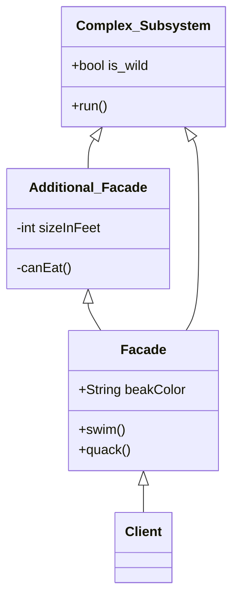
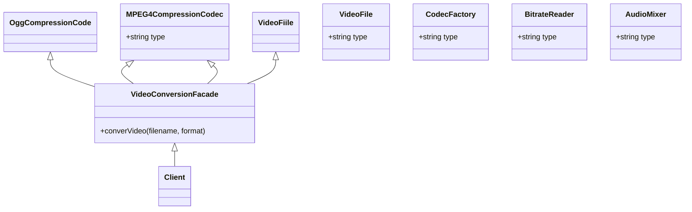
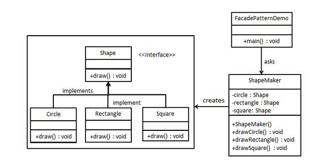

# Facade

## :bell: Intent
> Facade는 라이브러리, 프레임워크 또는 기타 복잡한 클래스 집합에 대한 단순화된 인터페이스를 제공하는 구조패턴입니다.
> Provides a simplified interface to a library, a framework, or any other complex set of classes.

## :bell: Motivation
:cold_sweat:발생 가능한 문제
> 정교한 라이브러리나 프레임워크에 속하는 광범위한 객체들의 집합으로 코드를 작동시켜야 한다고 상상해 보십시오. 일반적으로 이러한 객체들을 모두 초기화하고, 종속성을 추적하고, 올바른 순서로 함수를 실행하는 등의 작업을 수행해야 합니다. 결과적으로 클래스의 비즈니스 논리가 타사 클래스의 구현 세부 정보와 밀접하게 연결되어 이해하고 유지 관리하기가 어렵습니다.

:blush:해결책
> 파사드는 많은 변경 가능한 부분을 포함하는 `복잡한 하위 시스템에 대한 간단한 인터페이스`를 제공하는 클래스입니다. 파사드는 하위 시스템과 직접 작업하는 것과 비교하여 제한된 기능을 제공할 수 있습니다. 그러나 여기에는 클라이언트가 정말로 중요하게 생각하는 기능만 포함됩니다.
파사드는 특히 `수십 가지 기능이 있는 정교한 라이브러리와 앱을 통합해야 할 때 편리하지만 기능은 아주 약간만 필요할때 유용합니다.`
예를 들어, 고양이와 함께 짧은 재미있는 비디오를 소셜 미디어에 업로드하는 앱은 잠재적으로 전문적인 비디오 변환 라이브러리를 사용할 수 있습니다. 그러나 실제로 필요한 것은 단일 메서드인 encode(filename, format)가 있는 클래스뿐입니다. 이러한 클래스를 만들고 비디오 변환 라이브러리와 연결하면 첫 번째 파사드가 생깁니다.

## :balloon: Structure of classes

- `Facade`는 하위 시스템 기능의 특정 부분에 대한 편리한 액세스를 제공합니다. 클라이언트의 요청을 어디로 보내야 하는지, 움직이는 모든 부품을 어떻게 작동해야 하는지 알고 있습니다.
- `Additional Facade` 클래스는 관련 없는 기능으로 단일 외관을 오염시켜 또 다른 복잡한 구조를 만들 수 있는 것을 방지하기 위해 생성할 수 있습니다. Additional Facade는 클라이언트와 다른 Facade 모두에서 사용할 수 있습니다.
- `Complex Subsystem`은 수십 개의 다양한 객체로 구성됩니다. 그들 모두가 의미 있는 일을 하도록 하려면 올바른 순서로 개체를 초기화하고 적절한 형식의 데이터를 제공하는 것과 같은 하위 시스템의 구현 세부 정보를 자세히 살펴봐야 합니다.
- `Subsystem` 클래스는 Facade의 존재를 인식하지 못합니다. 그들은 시스템 내에서 작동하고 서로 직접 작동합니다.
- `Client`는 서브시스템 개체를 직접 호출하는 대신 Facade를 사용합니다.

## :balloon: Applicability
(1) 복잡한 서브 시스템에 대한 제한적이지만 간단한 인터페이스가 필요한 경우 Facade Pattern을 사용하십시오
종종 서브시스템은 시간이 지남에 따라 더 복잡해집니다. Design Pattern을 적용해도 일반적으로 더 많은 클래스가 생성됩니다. 서브 시스템은 다양한 상황에서 더 유연해지고 더 쉽게 재사용할 수 있지만 크라이언트에서 요구하는 구성 및 상용구 코드의 양은 점점 더 커집니다. Facade는 대부분의 클라이언트 요구 사항에 맞는 서브시스템의 가장 많이 사용되는 기능에 대한 `바로 가기`를 제공하여 이 문제를 해결하려고 시도합니다.

(2) 서브시스템을 계층으로 구성하려는 경우 Facade를 사용하십시오
서브시스템의 `각 레벨에 대한 진입점을 정의하기 위해 파사드`를 작성하십시오. 파사드를 통해서만 통신하도록 요구함으로써 여러 서브시스템간의 결합을 줄일 수 있습니다.
예를 들어 비디오 변환 프레임워크로 돌아가 보겠습니다. 비디오 및 오디오 관련의 두 가지 계층으로 나눌 수 있습니다. 각 레이어에 대해 파사드를 만든 다음 `각 레이어의 클래스가 해당 파사드를 통해 서로 통신`하도록 할 수 있습니다. 이 접근 방식은 Mediator 패턴과 매우 유사해 보입니다.

## :balloon: How to implement
1. 기존 서브시스템이 이미 제공하는 것보다 더 간단한 인터페이스를 제공할 수 있는지 확인하십시오. 이 인터페이스가 클라이언트 코드를 여러 하위 시스템의 클래스와 `독립적으로` 만든다면 올바른 길을 가고 있는 것입니다.
2. 새 파사드 클래스에서 이 인터페이스를 선언하고 구현하십시오. 파사드는 클라이언트 코드의 호출을 하위 시스템의 적절한 개체로 리디렉션해야 합니다. 파사드는 클라이언트 코드가 이미 이 작업을 수행하지 않는 한 하위 시스템을 초기화하고 추가 수명 주기를 관리해야 합니다.
3. 패턴의 이점을 최대한 활용하려면 모든 클라이언트 코드가 파사드를 통해서만 하위 시스템과 통신하도록 합니다. 이제 클라이언트 코드는 하위 시스템 코드의 변경 사항으로부터 보호됩니다. 예를 들어, 서브시스템이 새 버전으로 업그레이드되면 파사드의 코드만 수정하면 됩니다.
4. 파사드가 너무 커지면 동작의 일부를 새롭고 세련된 파사드 클래스로 추출하는 것을 고려하십시오.   

##  :balloon:  Java Library
• `javax.faces.context.FacesContext` 는 내부적으 'LifeCycle', ViewHandler,NavigationHandler 클래스를 사용하지만, 대부분 클라이언트는 이를 인식하지 못한다.    
• `javax.faces.context.ExternalContext` 는  ServletContext, HttpSession, HttpServletRequest, HttpServletResponse를 사용합니다. 

## :balloon: Releations with Other Patterns
- Facade는 기존 개체에 대한 새 인터페이스를 정의하는 반면 `Adapter`는 기존 인터페이스를 사용 가능하게 만들려고 합니다. 또한 Adapter는 일반적으로 하나의 객체만 Wrapping 하는 반면 Facade는 개체의 전체 하위 시스템과 함께 작동합니다.
- `Abstract Factory`는 클라이언트 코드에서 서브시스템 객체가 **생성되는 방식만 숨기고 싶을 때** Facade의 대안으로 사용할 수 있습니다.
- `Flyweight`는 많은 작은 객체를 만드는 방법을 보여주는 반면 Facade는 전체 서브시스템을 나타내는 단일 객체를 만드는 방법을 보여 줍니다.
- Facade와 `Mediator`는 비슷한 역할을 합니다. 밀접하게 연결된 많은 클래스 간의 협업을 구성하려고 합니다. Facade는 객체의 서브시스템에 대한 단순화된 인터페이스를 정의하지만 새로운 기능을 도입하지는 않습니다. 서브시스템 자체는 Facade를 인식하지 못합니다. 서브시스템 내의 개체는 직접 통신할 수 있습니다. Mediator는 시스템 구성 요소간의 통신을 중앙 집중화 합니다. 구성 요소는 Mediator 개체에 대해서만 알고 직접 통신하지 않습니다.
- 대부분의 경우 단일 Facade 객체로 충분하기 때문에 Facade 클래스는 종종 `싱글톤`으로 변환될 수 있습니다.
- Facade는 복잡한 엔티티를 버퍼링하고 자체적으로 초기화 한다는 점에서 `Proxy`와 유사합니다. Facade와 달리 Proxy는 서비스 객체와 동일한 인터페이스를 가지고 있어 상호 교환이 가능합니다.

> 하위 시스템에 대한 인터페이스 제공 시 : 복잡한구조라 간단하게 제공하고싶으면 Facade, 다른 인터페이스끼리 자유롭게 호환될 수 있게 하고싶으면 Adapter

##  :bulb:  Code example

**1) 복잡한 비디오 변환 라이브러리를 위한 간단한 인터페이스**  

   이 예에서 Facade는 복잡한 비디오 변환 프레임워크와의 통신을 단순화합니다.  
   Facade는 프레임워크의 클래스를 구성하고 결과를 검색하는 모든 복잡성을 처리하는 인터페이스를 제공합니다.

**2) 형태 만드는 라이브러리를 위한 간단한 인터페이스 **  

이 예에서 Facade는 복잡한 형태를 만드는 로직을 단순화합니다.  

