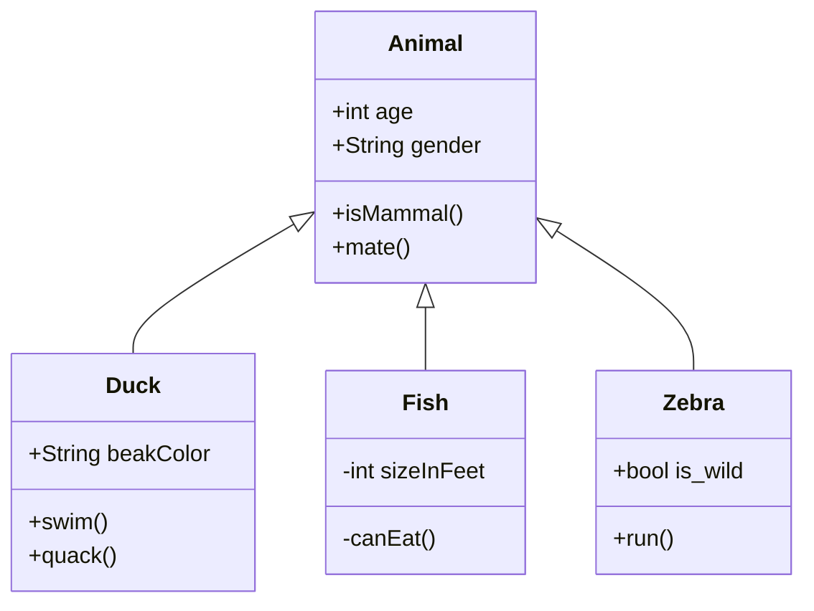

# Facade

---

# 1. Intent
라이브러리, 프레임워크 또는 기타 복잡한 클래스 집합에 대한 단순화된 인터페이스를 제공하는 구조적 디자인 패턴입니다.

# 2. Motivation

# 3. Structure

1. Facade
2. Additional Facade
3. Complex Subsystem
4. Client 

# 4. Code example

1)  Simple Interface For a Complex video Conversion library

2) Retrofit
기존 http를 개발하기위해서는 
연결
캐싱
실패한 요청의 재시도
스레딩
응답분석
오류처리
 등을 고려해야합니다. 성능좋고 오류적은 http 요청한번을위해 서는 말이다. 

