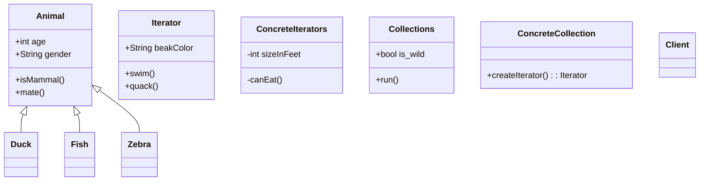

Here are some examples from core Java libraries:
All implementations of java.util.Iterator (also java.util.Scanner).
All implementations of java.util.Enumeration

# Structure

`Iterator`
The Iterator interface declares the operations required for traversing a collection: fetching the next element, retrieving the current position, restarting iteration, etc.

`Concrete Iterators`
Concrete Iterators implement specific algorithms for traversing a collection. The iterator object should track the traversal progress on its own. This allows several iterators to traverse the same collection independently of each other.

`Collections`
The Collection interface declares one or multiple methods for getting iterators compatible with the collection. Note that the return type of the methods must be declared as the iterator interface so that the concrete collections can return various kinds of iterators.

`Concrete Collections`
Concrete Collections return new instances of a particular concrete iterator class each time the client requests one. You might be wondering, where’s the rest of the collection’s code? Don’t worry, it should be in the same class. It’s just that these details aren’t crucial to the actual pattern, so we’re omitting them.

`Client`
The Client works with both collections and iterators via their interfaces. This way the client isn’t coupled to concrete classes, allowing you to use various collections and iterators with the same client code.

일반적으로 client는 자체적으로 반복자를 생성하지 않고 대신 컬렉션에서 가져옵니다. 그러나 어떤 경우에는 클라이언트가 직접 만들 수 있습니다. 예를 들어 클라이언트가 자체 특수 반복기를 정의할 때.

