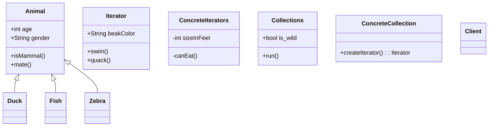

Here are some examples from core Java libraries:
All implementations of java.util.Iterator (also java.util.Scanner).
All implementations of java.util.Enumeration

# Structure

## Intent

Lets you traverse elements of a collection without exposing its underlying representation (list, stack, tree, etc.).

기본 표현(목록, 스택, 트리 등)을 노출하지 않고 컬렉션의 요소를 탐색할 수 있습니다.

반복자 패턴은 컬렉션을 반복하는 표준 방법을 제공합니다.
정렬된 개체 그룹을 보유하는 클래스 또는 구조체가 있고
"for in" 루프를 사용하여 반복 가능하게 만들고 싶을 때
반복자 패턴을 사용합니다.

- All implementations of java.util.Iterator (also, java.util.Scanner)
- All implementations of java.util.Enumeration

한국어
식별: Iterator는 탐색 방법(예: 다음, 이전 및 기타)으로 쉽게 인식할 수 있습니다.
반복자를 사용하는 클라이언트 코드는 순회 중인 컬렉션에 직접 액세스하지 못할 수 있습니다.

## Motivation

## Structure of classes

`Iterator`
The Iterator interface declares the operations required for traversing a collection: fetching the next element, retrieving the current position, restarting iteration, etc.

`Concrete Iterators`
Concrete Iterators implement specific algorithms for traversing a collection. The iterator object should track the traversal progress on its own. This allows several iterators to traverse the same collection independently of each other.

`Collections`
The Collection interface declares one or multiple methods for getting iterators compatible with the collection. Note that the return type of the methods must be declared as the iterator interface so that the concrete collections can return various kinds of iterators.

`Concrete Collections`
Concrete Collections return new instances of a particular concrete iterator class each time the client requests one. You might be wondering, where’s the rest of the collection’s code? Don’t worry, it should be in the same class. It’s just that these details aren’t crucial to the actual pattern, so we’re omitting them.

`Client`
The Client works with both collections and iterators via their interfaces. This way the client isn’t coupled to concrete classes, allowing you to use various collections and iterators with the same client code.

일반적으로 client는 자체적으로 반복자를 생성하지 않고 대신 컬렉션에서 가져옵니다. 그러나 어떤 경우에는 클라이언트가 직접 만들 수 있습니다. 예를 들어 클라이언트가 자체 특수 반복기를 정의할 때.

## Java Library

## Example Code
**소셜 네트워크 프로필 반복**

이 예에서 Iterator 패턴은 클라이언트 코드에 통신 세부 정보를 노출하지 않고 원격 소셜 네트워크 컬렉션의 소셜 프로필을 살펴보는 데 사용됩니다.
