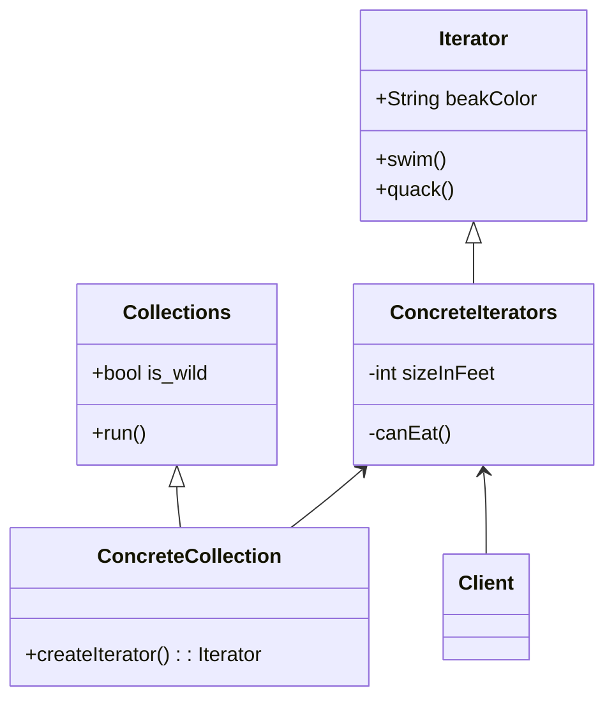

# Iterator

## :bell: Intent
기본 표현(목록, 스택, 트리 등)을 노출하지 않고 컬렉션의 요소를 탐색할 수 있습니다.
Lets you traverse elements of a collection without exposing its underlying representation (list, stack, tree, etc.).
`컬렉션 구현 방법`을 노출시키지 않으면서도 그 집합체 안에 들어있는 모든 항목에 접근할 방법을 제공하는 디자인 패턴내부구조를 노출하지 않고, 복잡 객체의 원소를 순차적으로 접근 가능하게 해주는 행위 패턴

반복자 패턴은 컬렉션을 반복하는 표준 방법을 제공합니다.
정렬된 개체 그룹을 보유하는 클래스 또는 구조체가 있고 "for in" 루프를 사용하여 반복 가능하게 만들고 싶을 때 반복자 패턴을 사용합니다.

## :bell: Motivation
:cold_sweat:발생 가능한 문제
>컬렉션은 프로그래밍에서 가장 많이 사용되는 데이터 유형 중 하나입니다. 그럼에도 불구하고 컬렉션은 개체 그룹에 대한 컨테이너일 뿐입니다.
대부분의 컬렉션은 요소를 간단한 `list`에 저장합니다. 그러나 그 중 일부는 `스택, 트리, 그래프` 및 기타 복잡한 데이터 구조를 기반으로 합니다.      
> 그러나 `컬렉션이 어떻게 구성되어 있든` 다른 코드에서 이러한 요소를 사용할 수 있도록 컬렉션은 해당 요소에 액세스할 수 있는 방법을 제공해야 합니다. 
> `동일한 요소에 계속해서 액세스하지 않고` 컬렉션의 각 요소를 통과하는 방법이 있어야 합니다.    
목록을 기반으로 하는 컬렉션이 있는 경우 이는 쉬운 작업처럼 들릴 수 있습니다. 모든 요소를 반복하기만 하면 됩니다. 그러나 트리와 같은 복잡한 데이터 구조의 요소를 어떻게 순차적으로 탐색합니까 예를 들어, 어느 날 당신은 나무의 깊이 우선 탐색으로 괜찮을 수 있습니다. 그러나 다음 날에는 너비 우선 탐색이 필요할 수 있습니다. 그리고 다음 주에는 트리 요소에 대한 임의 액세스와 같은 다른 것이 필요할 수 있습니다. 
> 동일한 컬렉션을 여러 가지 방법으로 순회할 수 있습니다.    
컬렉션에 더 많은 순회 알고리즘을 추가하면 효율적인 데이터 저장이라는 기본 책임이 점차 흐려집니다. 또한 일부 알고리즘은 특정 응용 프로그램에 맞게 조정될 수 있으므로 일반 컬렉션 클래스에 포함하는 것이 이상할 수 있습니다.
반면에 다양한 컬렉션과 함께 작동해야 하는 클라이언트 코드는 요소를 저장하는 방법에 신경조차 쓰지 않을 수 있습니다. 그러나 컬렉션은 모두 해당 요소에 액세스하는 다른 방법을 제공하므로 코드를 특정 컬렉션 클래스에 연결하는 것 외에는 다른 옵션이 없습니다.

:blush:해결책
>Iterator 패턴의 주요 아이디어는 `컬렉션의 순회 동작을 iterator라는 별도의 객체로 추출`하는 것입니다.     
> 알고리즘 자체를 구현하는 것 외에도 iterator 객체는 현재 위치 및 끝까지 남은 요소 수와 같은 모든 탐색 세부 정보를 캡슐화합니다. 이 때문에 여러 반복자가 서로 독립적으로 동시에 동일한 컬렉션을 통과할 수 있습니다.     
> 일반적으로 반복자는 컬렉션의 요소를 가져오기 위한 하나의 기본 방법을 제공합니다. 클라이언트는 아무 것도 반환하지 않을 때까지 이 메서드를 계속 실행할 수 있습니다. 이는 반복자가 모든 요소를 순회했음을 의미합니다.     
> 모든 반복자는 동일한 인터페이스를 구현해야 합니다. 이렇게 하면 적절한 반복자가 있는 한 클라이언트 코드가 모든 컬렉션 유형 또는 순회 알고리즘과 호환됩니다. 컬렉션을 순회하는 특별한 방법이 필요한 경우 컬렉션이나 클라이언트를 변경할 필요 없이 새 반복자 클래스를 만들기만 하면 됩니다.
> 

## :balloon: Structure of classes

`Iterator`
Iterator 인터페이스는 컬렉션 순회에 필요한 작업(다음 요소 가져오기, 현재 위치 검색, 반복 다시 시작 등)을 선언합니다.

`Concrete Iterators`
구체 반복자는 컬렉션 순회를 위한 특정 알고리즘을 구현합니다. iterator 객체는 순회 진행 상황을 자체적으로 추적해야 합니다. 이를 통해 여러 반복자가 서로 독립적으로 동일한 컬렉션을 순회할 수 있습니다.

`Collections`
Collection 인터페이스는 컬렉션과 호환되는 반복자를 얻기 위한 하나 이상의 메서드를 선언합니다. 구체적인 컬렉션이 다양한 종류의 반복자를 반환할 수 있도록 메서드의 반환 유형을 반복자 인터페이스로 선언해야 합니다.

`Concrete Collections`
Concrete Collection 은 클라이언트가 요청할 때마다 특정 구체 반복기 클래스의 새 인스턴스를 반환합니다. 컬렉션의 나머지 코드는 어디에 있습니까? 걱정하지 마십시오. 같은 클래스에 있어야 합니다. 이러한 세부 사항은 실제 패턴에 중요하지 않으므로 생략합니다.

`Client`
일반적으로 client는 자체적으로 반복자를 생성하지 않고 대신 컬렉션에서 가져옵니다. 그러나 어떤 경우에는 클라이언트가 직접 만들 수 있습니다. 예를 들어 클라이언트가 자체 특수 반복기를 정의할 때.

## :balloon: Applicability
(1) 컬렉션의 내부에 복잡한 데이터 구조가 있지만 그 `복잡성을 클라이언트로부터 숨기고 싶을 때` Iterator 패턴을 사용하십시오(`편의`나 `보안`상의 이유로).      
반복자는 복잡한 데이터 구조 작업의 세부 사항을 캡슐화하여 클라이언트에 컬렉션 요소에 액세스하는 몇 가지 간단한 방법을 제공합니다. 이 접근 방식은 클라이언트에게 매우 편리하지만 컬렉션을 직접 사용하는 경우 클라이언트가 수행할 수 있는 부주의하거나 악의적인 작업으로부터 컬렉션을 보호합니다.

(2) 패턴을 사용하여 앱 전체에서 순회 코드의 `중복을 줄이`십시오.      
중요하지 않은 반복 알고리즘의 코드는 매우 부피가 큰 경향이 있습니다. 앱의 비즈니스 로직 내에 배치되면 원래 코드의 책임이 흐려지고 유지 관리가 어려워질 수 있습니다. 순회 코드를 지정된 반복기로 이동하면 애플리케이션 코드를 보다 간결하고 깔끔하게 만들 수 있습니다.

(3) 코드가 다른 데이터 구조를 순회할 수 있기를 원하거나 이러한 구조의 유형을 `미리 알 수 없는 경우` Iterator를 사용하십시오.      
패턴은 컬렉션과 반복자 모두에 대한 몇 가지 일반 인터페이스를 제공합니다. 코드가 이제 이러한 인터페이스를 사용한다는 점을 감안할 때 이러한 인터페이스를 구현하는 다양한 종류의 컬렉션 및 반복자를 전달하면 여전히 작동합니다.

## :balloon: Releations with Other Patterns
- Iterator를 사용하여 `Composite` 트리를 탐색할 수 있습니다.
- Iterator와 함께 `Factory Method` 를 사용하여 컬렉션 하위 클래스가 컬렉션과 호환되는 다양한 유형의 반복자를 반환하도록 할 수 있습니다.
- `Memento`를 Iterator와 함께 사용하여 현재 반복 상태를 캡처하고 필요한 경우 롤백할 수 있습니다.
- `Visitor`는 Iterator와 함께 사용하여 복잡한 데이터 구조를 순회하고 해당 요소에 대해 일부 작업을 실행할 수 있습니다. 모두 다른 클래스가 있더라도 마찬가지입니다.

## :bulb: Java Library
- `java.util.Iterator` (also, java.util.Scanner)의 모든 구현 클래스들
- `java.util.Enumeration`의 모든 구현 클래스들

## :bulb: Example Code
**1) 소셜 네트워크 프로필 반복**
이 예에서 Iterator 패턴은 클라이언트 코드에 통신 세부 정보를 노출하지 않고   
원격 소셜 네트워크 컬렉션의 소셜 프로필을 살펴보는 데 사용됩니다.

**2) 이름 반복**
Iterator 패턴은 이름을 어떤식으로 반복하는지에 대한 세부 정보를 노출하지 않고 
이름 목록을 살펴보는데 사용합니다. 

