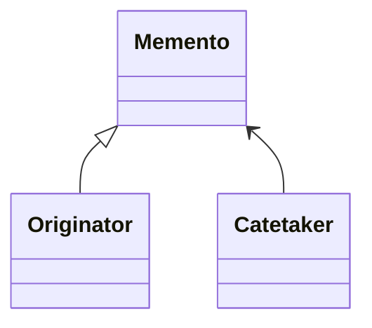

# Memento

## :bell: Intent
구현의 세부 사항을 공개하지 않고 `객체의 이전 상태`를 `저장`하고 `복원`할 수 있는 디자인 패턴입니다.

## :bell: Motivation
:cold_sweat:발생 가능한 문제

>텍스트 편집기 앱을 만들때 필요한 기능은 무엇일까요? 간단한 텍스트 편집 외에도 편집기는 텍스트 서식 지정, 인라인 이미지 삽입 등을 할 수 있습니다. 어느 시점에서 사용자가 텍스트에 대해 수행된 작업을 실행 취소할 수 있는 기능도 필요할 것 같습니다. 이 기능은 요즘 사람들이 모든 앱에 이 기능이 있을 것으로 기대하는 만큼 수년에 걸쳐 매우 보편화되었습니다. 
>구현을 위해 직접 접근 방식을 선택해봅시다. 어떤 `작업을 수행하기 전`에 앱은 `모든 개체의 상태를 기록하고 일부 저장소에 저장`합니다. 나중에 사용자가 작업을 되돌리기로 결정하면 앱은 기록에서 최신 스냅샷을 가져와 모든 개체의 상태를 복원하는 데 사용합니다.

>`복사해야 할 필드들이 private 이면 접근 불가!!! 복사해야 할 필드들이 public 이면 unsafe !!!`

>상태 스냅샷은 아마도 객체의 모든 필드를 살펴보고 해당 값을 저장소에 복사해야 할 것입니다. 그러나 이는 객체에 내용에 대한 액세스 제한이 상당히 완화된 경우에만 작동합니다. 불행히도, 대부분의 실제 객체는 다른 사람들이 내부를 쉽게 들여다볼 수 없도록 하여 모든 중요한 데이터를 비공개 필드에 숨깁니다.
>지금은 그 문제를 무시하고 객체가 public 이라 가정해 봅시다. 열린 관계를 선호하고 상태를 공개적으로 유지하는 것입니다. 이 접근 방식은 즉각적인 문제를 해결하고 원하는 대로 객체 상태의 스냅샷을 생성할 수 있지만 여전히 몇 가지 심각한 문제가 있습니다. 그렇게되면 편집기 클래스의 public 필드를 추가 또는 제거할 수 있게 됩니다. 
>`클래스의 모든 내부 세부 정보를 노출하여 너무 취약하게 만들거나, 해당 상태에 대한 액세스를 제한하여 스냅샷 생성을 불가능하게 만듭니다.`

:blush:해결책

> 우리가 방금 경험한 모든 문제는 `깨진 캡슐화`로 인해 발생합니다. 일부 개체는 예상보다 더 많은 작업을 수행하려고 합니다. 어떤 행동을 수행하는 데 필요한 데이터를 수집하기 위해 이러한 개체가 실제 작업을 수행하도록 하는 대신 다른 개체의 사적인 공간을 침범합니다. 
Memento 패턴은 `상태 스냅샷 생성을 해당 상태의 실제 소유자인 originator 객체에게 위임`합니다. 따라서 `외부`에서 편집기의 상태를 복사하려고 하는 다른 개체 대신 편집기 클래스 자체가 자체 상태에 대한 전체 액세스 권한을 가지고 있기 때문에 스냅샷을 만들 수 있습니다. 
> 이 패턴은 `memento라는 특별한 객체에 객체의 상태 사본을 저장`하는 것을 제안합니다. memento의 내용은 그것을 생산한 것을 제외한 다른 어떤 객체에서도 접근할 수 없습니다. 다른 객체는 스냅샷의 메타데이터(생성 시간, 수행된 작업의 이름 등)를 가져올 수 있는 제한된 인터페이스를 사용하여 memento과 통신해야 하지만 스냅샷에 포함된 원래 객체의 상태는 허용하지 않습니다.
> 이러한 제한 정책을 사용하면 일반적으로 Catetaker이라고 하는 다른 개체 내부에 memento을 저장할 수 있습니다. Catetaker은 `제한된 인터페이스`를 통해서만 memento으로 작업하기 때문에 `memento 내부에 저장된 상태를 변경할 수 없습니다. 동시에 발신자는 memento 내부의 모든 필드에 액세스할 수 있으므로` 원하는 대로 이전 상태를 복원할 수 있습니다.
> 사용자가 실행 취소하면 기록이 스택에서 가장 최근의 memento을 가져와 편집기에 다시 전달하여 롤백을 요청합니다. 편집기는 memento에 대한 전체 액세스 권한이 있으므로 memento에서 가져온 값으로 자체 상태를 변경합니다.

## Structure of classes

`Originator`
Originator 클래스는 자체 상태의 스냅샷을 생성할 수 있을 뿐만 아니라 필요할 때 스냅샷에서 해당 상태를 복원할 수 있습니다. (클래스 상태 스냅샷 생성/복원)

`Memento`
Memento는 Originator 상태의 스냅샷 역할을 하는 값 개체입니다. 기념물을 변경할 수 없도록 만들고 생성자를 통해 데이터를 한 번만 전달하는 것이 일반적입니다. (originator 상태 스냅샷 )

`Caretaker`
Caretaker는 발신자의 상태를 캡처해야 하는 "시기"와 "이유"뿐만 아니라 언제 상태를 복원해야 하는지도 알고 있습니다.

Caretaker은 기념품 스택을 저장하여 작성자의 이력을 추적할 수 있습니다. 발신자가 과거로 돌아가야 할 때 관리인은 스택에서 맨 위의 기념품을 가져와 발신자의 복원 메서드에 전달합니다.

`implementation`
이 구현에서 memento 클래스는 발신자 내부에 중첩됩니다. 이렇게 하면 작성자가 비공개로 선언된 경우에도 기념품의 필드와 메서드에 액세스할 수 있습니다. 반면에, 관리인은 기념품의 필드와 메서드에 매우 제한적으로 액세스할 수 있으므로 메모리를 스택에 저장할 수 있지만 상태를 변조할 수는 없습니다.

## :balloon: Applicability
`(1) 객체의 이전 상태를 복원할 수 있도록 객체 상태의 스냅샷을 생성하려는 경우 Memento 패턴을 사용합니다.`   
Memento 패턴을 사용하면 개인 필드를 포함하여 개체 상태의 전체 복사본을 만들고 개체와 별도로 저장할 수 있습니다. 대부분의 사람들은 "실행 취소" 사용 사례 덕분에 이 패턴을 기억하지만 트랜잭션을 처리할 때도(예: 오류 발생 시 작업을 롤백해야 하는 경우) 필수 불가결합니다.

`(2) 객체의 필드/게터/세터에 대한 직접 액세스가 캡슐화를 위반할 때 패턴을 사용합니다.`  
Memento는 객체 자체가 상태의 스냅샷 생성을 담당하도록 합니다. 다른 객체는 스냅샷을 읽을 수 없으므로 원본 객체의 상태 데이터를 안전하고 안전하게 만듭니다.컬

## :bulb:  Releations with Other Patterns
- command 패턴과 유사하게 undo의 기능을 지원한다. 그렇지만  `Memento` 패턴은 state를 되돌리고, `command` 패턴은 실행된 명령 자체를 되돌린다는 점에서 차이가 있습니다.

- `Memento`를 `Iterator`와 함께 사용하여 현재 반복 상태를 캡처하고 필요한 경우 롤백할 수 있습니다.

- 때때로 `Prototype`은 `Memento`에 대한 더 간단한 대안이 될 수 있습니다. 이는 히스토리에 저장하려는 상태인 객체가 상당히 간단하고 외부 리소스에 대한 링크가 없거나 링크를 재설정하기 쉬운 경우 작동합니다.

## :bulb:  Java Library
- `java.io.Serializable`의 구현
- `javax.faces.component.StateHolder`의 구현

## Example Code
**CareTaker**

