* [ ] [ ]

### 설계(디자인)의 패턴을 배워야 하는 이유

디자인 패턴은 소프트웨어 디자인의 일반적인 문제에 대한 시도되고 테스트된 솔루션 의 툴킷입니다 . 이러한 문제가 발생하지 않더라도 패턴을 아는 것은 객체 지향 설계 원칙을 사용하여 모든 종류의 문제를 해결하는 방법을 가르쳐주기 때문에 여전히 유용합니다.

디자인 패턴은 우리가 보다 효율적으로 의사 소통하는 데 사용할 수 있는 공통 언어를 정의합니다. "아, 그냥 싱글톤을 사용하세요"라고 말하면 모두가 당신의 제안 뒤에 숨겨진 아이디어를 이해할 것입니다. 패턴과 이름을 안다면 싱글톤이 무엇인지 설명할 필요가 없습니다.

### 🚀️설계(디자인)의 패턴에 대한 비판

패턴 사용에 반대하는 가장 일반적인 주장을 살펴보겠습니다.

1. 약한 프로그래밍 언어를 위한 클러지
   : 일반적으로 패턴의 필요성은 사람들이 필요한 추상화 수준이 부족한 프로그래밍 언어나 기술을 선택할 때 발생합니다. 이 경우 패턴은 언어에 꼭 필요한 초능력을 부여하는 덩어리가 됩니다.
   예를 들어 전략 패턴은 대부분의 최신 프로그래밍 언어에서 간단한 익명(람다) 함수로 구현할 수 있습니다.
2. 비효율적인 솔루션
   패턴은 이미 널리 사용되는 접근 방식을 체계화하려고 합니다. 많은 사람들은 이러한 통합을 도그마로 간주하고 패턴을 프로젝트 컨텍스트에 적용하지 않고 "요점까지" 구현합니다.
3. 부당한 사용
   '망치만 있으면 모든 것이 못처럼 보입니다.'
   이것은 방금 패턴에 익숙해진 많은 초보자를 괴롭히는 문제입니다. 패턴에 대해 배운 후에는 더 간단한 코드로도 문제가 없는 상황에서도 모든 곳에 적용하려고 합니다.

### 🚀️디자인 패턴의 분류

디자인 패턴은 복잡성, 세부 수준 및 디자인 중인 전체 시스템에 대한 적용 범위에 따라 다릅니다. 나는 도로 건설에 대한 비유를 좋아합니다. 신호등을 설치하거나 보행자를 위한 지하 통로가 있는 전체 다층 인터체인지를 구축하여 교차로를 더 안전하게 만들 수 있습니다.

가장 기본적이고 낮은 수준의 패턴을 종종 관용구 라고 합니다. 일반적으로 단일 프로그래밍 언어에만 적용됩니다.

가장 보편적이고 높은 수준의 패턴은 아키텍처 패턴 입니다. 개발자는 이러한 패턴을 거의 모든 언어로 구현할 수 있습니다. 다른 패턴과 달리 전체 애플리케이션의 아키텍처를 설계하는 데 사용할 수 있습니다.

또한 모든 패턴은 의도 또는 목적에 따라 분류할 수 있습니다. 이 책은 세 가지 주요 패턴 그룹을 다룹니다.

- 생성 패턴 은 기존 코드의 유연성과 재사용을 증가시키는 객체 생성 메커니즘을 제공합니다.
- 구조 패턴 은 개체와 클래스를 더 큰 구조로 조합하는 방법을 설명하면서 이러한 구조를 유연하고 효율적으로 유지합니다.
- 행동 패턴 은 효과적인 의사 소통과 객체 간의 책임 할당을 처리합니다.

### 🚀️설계 원칙

1. 변경되는 부분을 캡슐화 하라
2. 구현이 아닌 인터페이스에 대한 프로그램
3. 상속(inheritance)보다는 구성(composition)을 선호하라

### 🚀️SOLID 원칙

1. S : 단일 책임 원칙 (SRP: Single responsibility principle)
   한 클래스는 하나의 책임만 가져야 한다.
2. O: 개방-폐쇄 원칙 (OCP: Open/closed principle)
   “소프트웨어 요소는 확장에는 열려 있으나 변경에는 닫혀 있어야 한다.”
3. L: 리스코프 치환 원칙 (LSP: Liskov substitution principle)
   “프로그램의 객체는 프로그램의 정확성을 깨뜨리지 않으면서 하위 타입의 인스턴스로 바꿀 수 있어야 한다.”
4. I: 인터페이스 분리 원칙 (ISP: Interface segregation principle)
   “특정 클라이언트를 위한 인터페이스 여러 개가 범용 인터페이스 하나보다 낫다.”
5. D: 의존관계 역전 원칙 (DIP: Dependency inversion principle)
   프로그래머는 “추상화에 의존해야지, 구체화에 의존하면 안된다.” 의존성 주입은 이 원칙을 따르는 방법 중 하나다.

#Class-level relationships

### Generalization(일반화)

- `Inheritance(상속)`인 경우에 사용
- 부모-자식 관계라고도 합니다. 일반화에서 한 요소는 다른 일반 구성요소의 전문화입니다. 대신할 수 있습니다.
- 상속 화살표는 `[슈퍼클래스]`를 가르킴
- 서브클래스 is a 슈퍼클래스 (SheepDog **<u>is</u>** a Dog)

### Realization(실체화)

- `Implements(구현)`인 경우에 사용
- interface의 spec(명세, 정의)만 있는 메서드를 오버라이딩 하여 실제 기능으로 구현 하는 것
- 화살표는 `<<인터페이스>>`을 가르킴
- 농부는 펫소유를 준수합니다. (Farmer **<u>conforms to</u>** PetOwning)
- 농부는 펫소유를 구현합니다. (Farmer **<u>implements</u>** PetOwning)

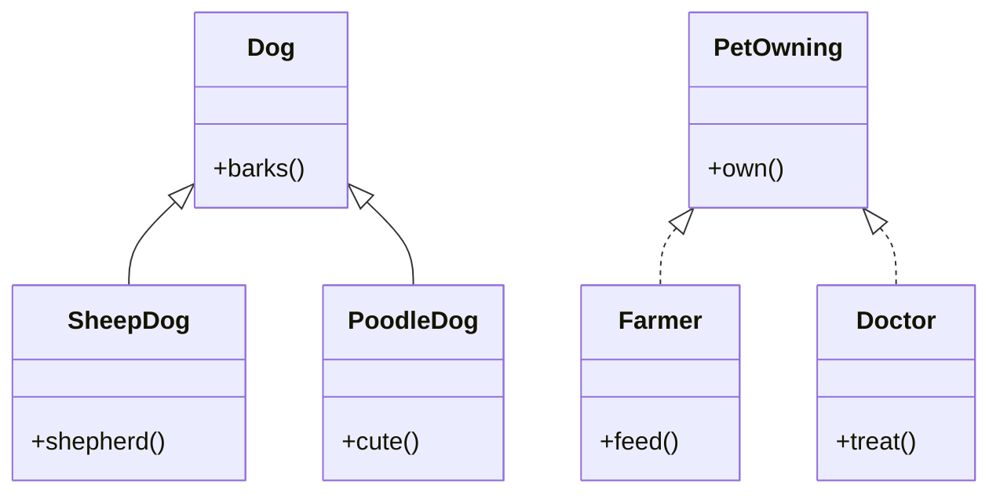

```kotlin
    // (상속) Inheritance
    open class Dog {
        fun barks()
    }
    class SheepDog: Dog {
        override fun bark()
        fun shepherd()
    }
    class PoodleDog: Dog {
        override fun bark()
        fun cute()
    }

    // (구현) Implements
    interface PetOwning {
        fun own()
    }
    class Farmer: PetOwning {
        fun feed()
    }
    class Farmer: PetOwning {
        fun treat()
    }
```

#Instance-level relationship

### Dependency(의존) 관계

- 사용 한다 “used”, 위임한다 “delegates to”, 인지한다"acquaintance" 라고도 한다. - 참조의 형태는 메서드 내에서 대상 클래스의 객체 생성, 객체 사용, 메서드 호출, 객체 리턴, 매개변수로 해당 객체를 받는 것 등을 말하며 해당 객체의 참조를 계속 유지하지는 않는다.
- 연관(association)의 일종
- 종속 관계에서는 이름에서 알 수 있듯이 둘 이상의 요소가 서로 종속되어 있습니다. 이러한 종류의 관계에서 특정 요소를 변경하면 다른 모든 요소도 변경의 영향을 받을 가능성이 있습니다.
- 종속성은 종속 및 독립 모델 요소 간의 의미론적 연결입니다. 한 요소(서버 또는 대상)의 정의가 변경되어 다른 요소(클라이언트 또는 소스)가 변경될 수 있는 경우 두 요소 사이에 존재합니다. 이 연결은 단방향입니다. 종속성은 클라이언트에서 공급자를 가리키는 열린 화살표가 있는 파선으로 표시됩니다.

### Association(연관) 관계

- UML 모델의 요소들을 연결하는 링크들의 집합이다. 또한 얼마나 많은 객체가 해당 관계에 참여하는지 정의합니다.
- 두 클래스 간의 연관에 대한 클래스 다이어그램 예
- 연관은 링크 패밀리를 나타냅니다. 두 개의 끝이 있는 이진 연결은 일반적으로 선으로 표시됩니다. 연관은 여러 클래스를 연결할 수 있습니다. 세 개의 링크가 있는 연결을 삼항 연결이라고 합니다. 연결에 이름을 지정할 수 있고 연결의 끝은 역할 이름, 소유권 표시기, 다중도, 가시성 및 기타 속성으로 장식될 수 있습니다.
- 양방향, 단방향, 집계(컴포지션 집계 포함) 및 반사의 네 가지 연결 유형이 있습니다. 양방향 및 단방향 연결이 가장 일반적인 연결입니다.
- 예를 들어, 비행 클래스는 양방향으로 비행기 클래스와 연결됩니다. 연관은 두 클래스의 개체 간에 공유되는 정적 관계를 나타냅니다.
- 합성연관과 집합연관이 있습니다.

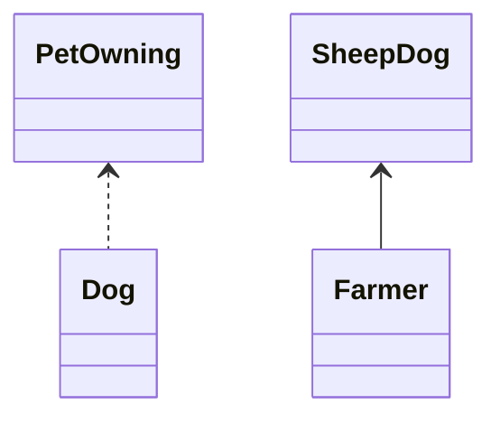

```kotlin
class PetOwning {
    val owner
}
class SheepDog {
    val name   
}
class Dog (petOwning: PetOwning) { // Dog 생성시 PetOwning 가 필요함 -> 의존함
    fun feed(){ // 따르다
        print("Hi!" + owner + "Give me Love!!"+ )
    }
}

class Farmer {
    fun love(val sheepDog){
        print("I love my"+ sheepDog.name)
    }
}

fun main(){
    val owning = PetOwning()    // 의존 클래스간 참조 유지 x, 연관 
    val dog = Dog(owning)
  
  
    val farmer = Farmer()
    val sheepDog = SheepDog()
    farmer.love(sheepDog) // 클래스간 참조를 유지 -> 연관
  
  
}


```

### Composition(합성, 복합연관)

- 강한 집합체 라는 의미
- 부분을 이루는 객체가 없이는 전체 객체의 의미가 없음
- ServerA 클래스가 소멸되면 Repository1 클래스도 소멸된다.
  Car에는 정확히 하나의 기화기가 있고 기화기는 하나의 Car의 일부입니다. 기화기는 특정 자동차에서 분리된 별도의 부품으로 존재할 수 없습니다. 하단의 다이어그램은 두 클래스 간의 집계를 보여줍니다. Pond에는 0개 이상의 Duck이 있고 Duck에는 한 번에 최대 하나의 Pond가 있습니다. 오리는 연못과 별도로 존재할 수 있습니다. 호수 근처에서 살 수 있습니다. 연못을 파괴할 때 일반적으로 모든 오리를 죽이지는 않습니다.
  컴포지션 관계의 UML 표현은 포함된 클래스를 포함하는 클래스에 연결하는 선의 포함된 클래스 끝에 채워진 다이아몬드 모양으로 컴포지션을 표시합니다.
- 멤버변수에 포함할 구성이 있는 연관, 생명주기가 구성과 동일
- 부분 객체는 전체 객체에 전속

### Aggregation(집합, 집합연관)

- 부분이 되는 객체를 외부에서 생성하여 넘겨받음
- Server2 클래스가 소멸되어도 Repository2 클래스는 소멸되지 않음
  두 클래스 간의 집계를 보여주는 클래스 다이어그램. 여기, 교수는 가르칠 수업이 '있다'.
  집계는 "has" 연관 관계의 변형입니다. 집계는 연관보다 더 구체적입니다. 관계의 일부-전체 또는 일부를 나타내는 연관입니다. 이미지에서 볼 수 있듯이 교수는 가르칠 수업이 '있다'. 연관 유형으로 집계는 이름을 지정할 수 있으며 연관과 동일한 장식을 가질 수 있습니다. 그러나 집계에는 두 개 이상의 클래스가 포함될 수 없습니다. 이진 연결이어야 합니다. 또한 구현하는 동안 집계와 연관 간의 차이가 거의 없으며 다이어그램에서 집계 관계를 모두 건너뛸 수 있습니다.
  클래스가 다른 클래스의 컬렉션 또는 컨테이너이지만 포함된 클래스에 컨테이너에 대한 강력한 수명 주기 종속성이 없을 때 집계가 발생할 수 있습니다. 컨테이너가 파괴될 때 컨테이너의 내용은 여전히 존재합니다.
  UML에서는 포함된 클래스에 연결하는 단일 선으로 포함된 클래스에 속이 빈 다이아몬드 모양으로 그래픽으로 표시됩니다. 집계는 물리적으로 여러 개의 하위 개체로 구성되어 있지만 의미상 확장된 개체로 많은 작업에서 하나의 단위로 처리됩니다.
  예: 도서관과 학생. 여기서 학생은 도서관 없이 존재할 수 있으며 학생과 도서관의 관계는 집합체이다.
- 멤버변수에 포함할 구성이 있는 연관, 생명주기가 구성과 다름
- 부분객체는 전체객체에 의해서 공유될 수 있음

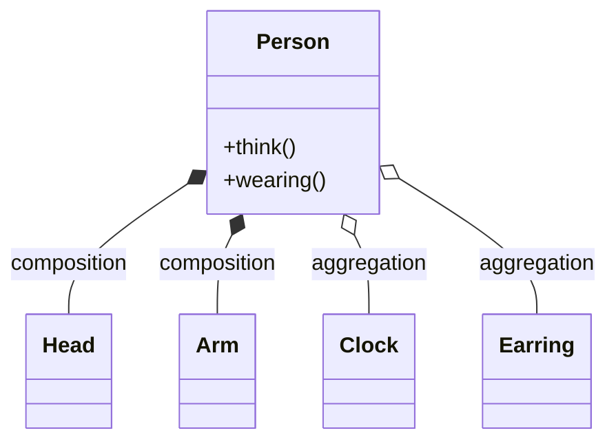

```kotlin
// Composition : 생명주기가 팔과 사람이 같음
// Aggregation : 생명주기가 시계와 사람이 같지 않음
class Head
class Arm
class Clock
class Earring
class Person(val _clock:Clock) {
    private val arm: Arm = Arm() // Arm 클래스 Person클래스 내부에서 (종속됨)
    private val head: Head: Head()
    private val accessories: MutableList()
  
    fun wearing(val accessory) {
        person.accessories.add(accessory)
    }
    fun think(){
        //...
    }
}

fun main(){
  
    // Clock 클래스는 Person 클래스 외부에서 생성됨 (독립됨)
    val clock: Clock = Clock()
    val earring: Earring = Earring()
  
    var person = Person(clock)
    person.accessories.add(clock) 
    person.accessories.add(earring)
}
```

A “owns” B = Composition : B has no meaning or purpose in the system without A
A “uses” B = Aggregation : B exists independently (conceptually) from A

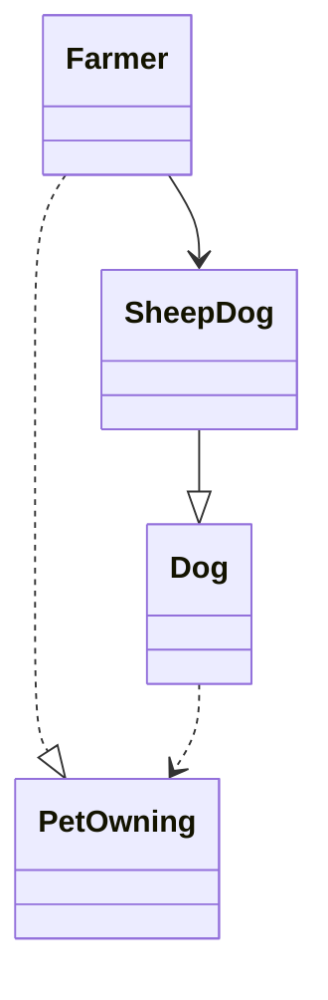

Here’s the complete class diagram for a `Farmer`
that <u>has</u> a `SheepDog`,
which <u>is</u> a `Dog`
that <u>delegates to</u> a `PetOwning` object

```kotlin
class SheepDog: Dog   // 1
interface PerOwing
class Farmer: PerOwing   // 2
class Dog(val perOwing: PetOwing)

fun main() {
	  val perOwing: PetOwing = SheepDog()
	  val dog = Dog(perOwing) // 4
}
```

---

객체의 생성과정을 추상화함으로써 인스턴스화할 때 인터페이스와 구현을 연결하는 다른방법을 제시한다

## 🚩 **생성 패턴**
1)`Abstract Factory`: 생성군들을 하나의 모아놓고 팩토리 중에서 선택하게 하는 패턴
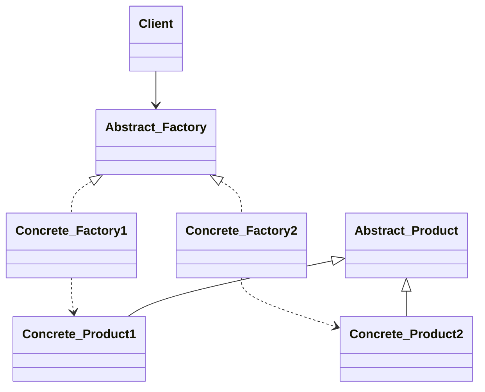
<details><summary></summary>
<div markdown="1">
- 구체적인 클래스에 의존하지 않고 서로 연관되거나 의존적인 객체들의 조합을 만드는 인터페이스를 제공하는 패턴으로 이 패턴을 통해 생성된 클래스에서는 사용자에게 인터페이스(API)를 제공하고, 구체적인 구현은 Concrete Product 클래스에서 이루어지는 특징을 갖는 디자인 패턴동일한 주제의 다른 팩토리 묶음

1. AbstractProduct
2. ConcreteProduct
3. AbstractFactory
4. ConcreteFactory
5. Client
</div></details>


2)`Builder`: 생산 단계를 캡슐화 하여 구축 공정을 동일하게 이용하도록 하는 패턴 
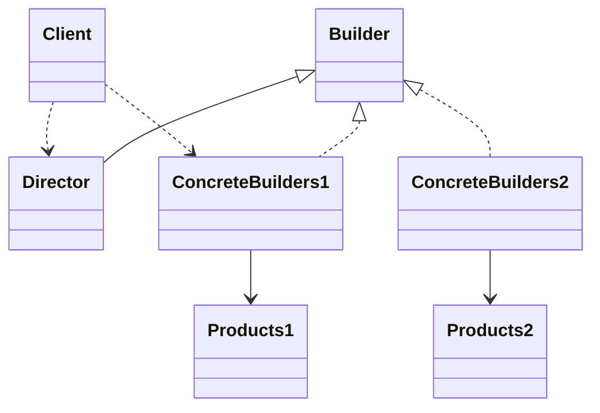
<details><summary></summary>
<div markdown="1">
- 복잡한 인스턴스를 조립하여 만드는 구조로, 복합 객체를 생성할 때 객체를 생성하는 방법(과정)과 객체를 구현(표현)하는 방법을 분리함으로써 동일한 생성 절차에서 서로 다른 표현 결과를 만들 수 있는 디자인 패턴생성과 표기를 분리해서 복잡한 객체를 생성
1. Builder
2. ConcreteBuilder
3. Director
4. Product
</div></details>


3)`Factory Method`: 객체를 생성하기 위한 인터페이스를 정의하여 어떤 클래스가 인스턴스화 될 것인지는 서브 클래스가 결정하도록 하는 패턴
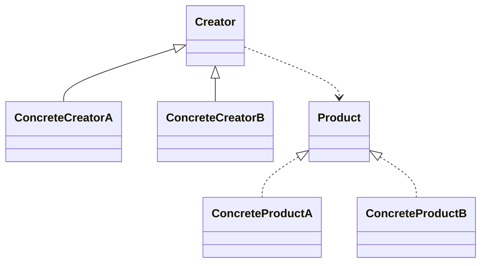
<details><summary></summary>
<div markdown="1">
Factory Method : 상위 클래스에서 객체를 생성하는 인터페이스를 정의하고, 하위 클래스에서 인스턴스를 생성하도록 하는 방식으로, 상위 클래스에서 인스턴스를 만드는 방법만 결정하고, 하위 클래스에서 그 데이터의 생성을 책임지고 조작하는 함수들을 오버로딩하여 인터페이스와 실제 객체를 생성하는 클래스를 분리할 수 있는 특성을 갖는 디자인 패턴생성할 객체의 클래스를 국한하지 않고 객체를 생성
1. Product
2. ConcreteProduct
3. Creator
4. ConcreteCreator
</div></details>


4)`Prototype`: 복사하여 새 개체를 생성할 수 있도록 하는 패턴
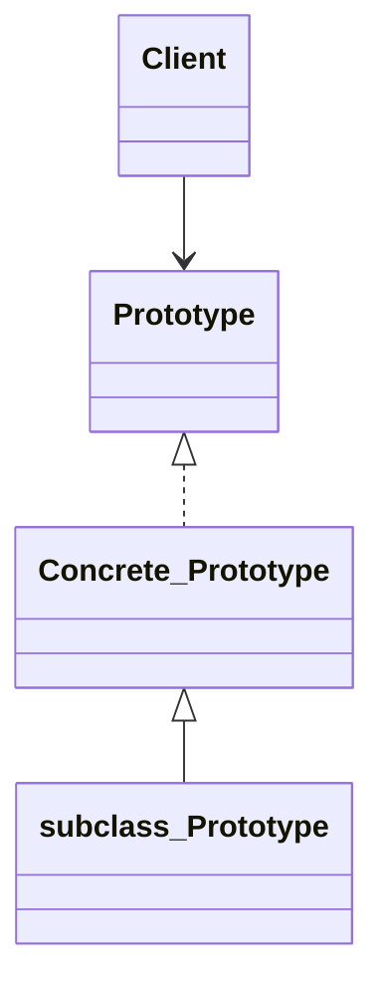
<details><summary></summary>
<div markdown="1">
- Prototype : 처음부터 일반적인 원형을 만들어 놓고, 그것을 복사한 후 필요한 부분만 수정하여 사용하는 패턴으로, 생성할 객체의 원형을 제공하는 인스턴스에서 생성할 객체들의 타입이 결정되도록 설정하며 객체를 생성할 때 갖추어야 할 기본 형태가 있을 때 사용 되는 패턴기존 객체를 복제함으로써 객체를 생성
</div></details>


5)`Singleton`: 유일한 하나의 인스턴스를 보장하도록 하는 패턴
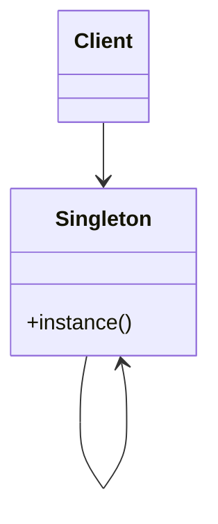
<details><summary></summary>
<div markdown="1">
- Singleton : 전역 변수를 사용하지 않고 객체를 하나만 생성하도록 하며, 생성된 객체를 어디에서든지 참조할 수 있도록 하는 디자인 패턴한 클래스에 한 객체만 존재하도록 제한
1. Prototype
2. ConcretePrototype
3. Client
</div></details>


## 🚩**구조 패턴**

5)`Adapter`: 인터페이스로 인해 함께 사용하지 못하는 클래스를 함께 사용하도록 하는 패턴
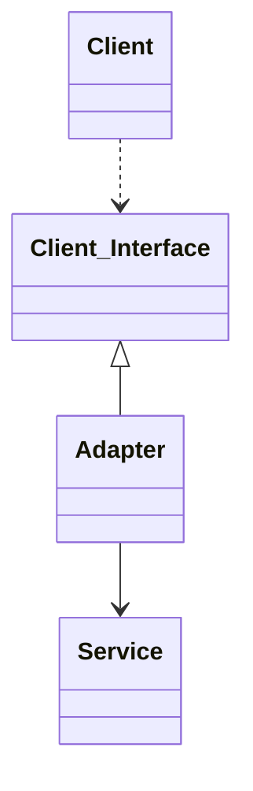
<details><summary></summary>
<div markdown="1">
- Adapter : 기존에 생성된 클래스를 재사용할 수 있도록 중간에서 맞춰주는 역할을 하는 인터페이스를 만드는 패턴으로, 상속을 이용하는 클래스 패턴과 위임을 이용하는 인스턴스 패턴의 두 가지 형태로 사용되는 디자인 패턴인터페이스가 호환되지 않는 클래스들을 함께 이용할 수 있도록 타 클래스의 인터페이스를 기존 인터페이스에 덧씌움
1. Target
2. Client
3. Adaptee
4. Adapter
</div></details>


7)`Bridge`: 추상과 구현을 분리하여 결합도를 낮춘 패턴
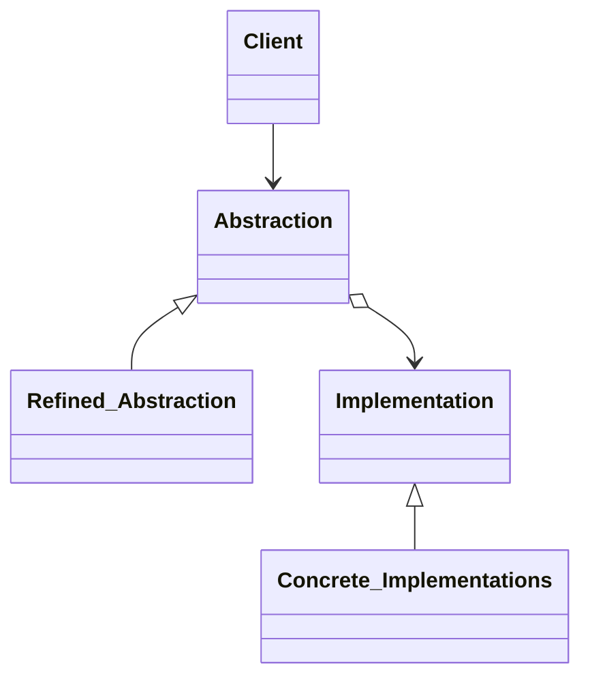
<details><summary></summary>
<div markdown="1">
- Bridge : 기능의 클래스 계층과 구현의 클래스 계층을 연결하고, 구현부에서 추상 계층을 분리하여 추상화된 부분과 실제 구현 부분을 독립적으로 확장할 수 있는 디자인 패턴구현뿐만 아니라, 추상화된 부분까지 변경해야 하는 경우 활용
1. Abstraction
2. Refined Abstraction
3. Implementor
4. Concrete Implementor
</div></details>


8)`Composite`: 개별 객체와 복합 객체를 클라이언트에서 동일하게 사용하도록 하는 패턴
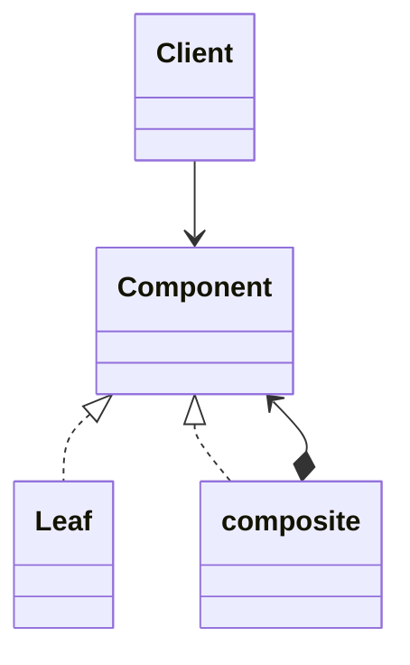
<details><summary></summary>
<div markdown="1">
- Composite : 객체들의 관계를 트리 구조로 구성하여 부분-전체 계층을 표현하는 패턴으로, 사용자가 단일 객체과 복합 객체 모두 동일하게 다루도록 하는 패턴복합 객체와 단일 객체를 동일하게 취급
</div></details>


9)`Decorator`: 소스를 변경하지 않고 기능을 확장하도록 하는 패턴
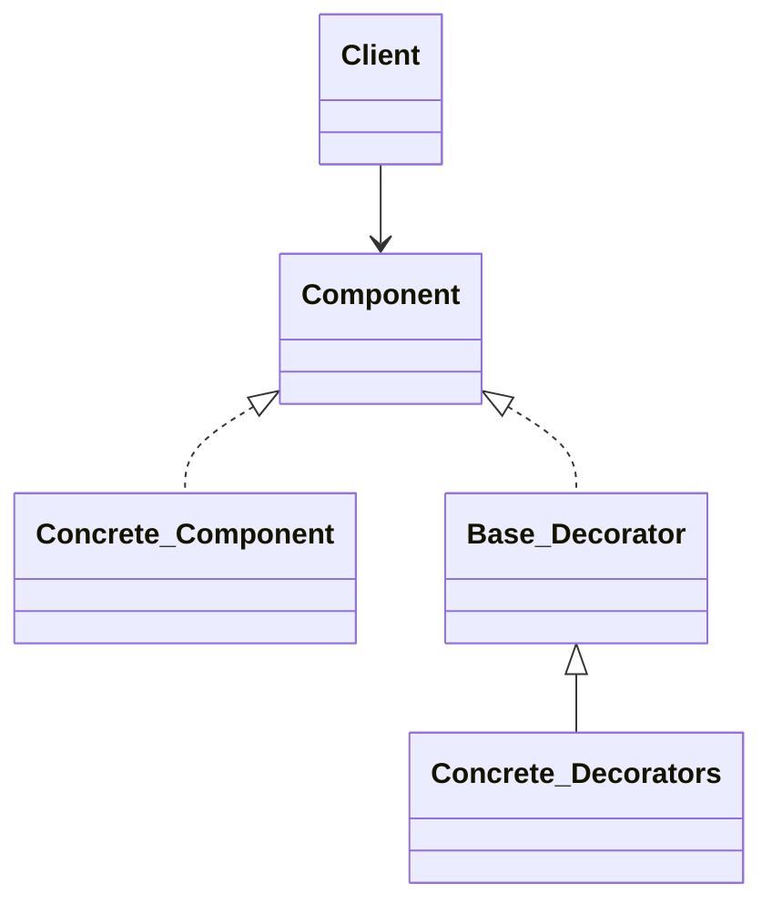
<details><summary></summary>
<div markdown="1">
- Decorator : 기존에 구현되어 있는 클래스에 필요한 기능을 추가해 나가는 설계 패턴으로 기능 확장이 필요할 때 객체 간의 결합을 통해 기능을 동적으로 유연하게 확장할 수 있게 해주어 상속의 대안으로 사용되는 디자인 패턴객체의 결합을 통해 기능을 동적으로 유연하게 확장
</div></details>

3)`Facade`: 하나의 인터페이스를 통해 느슨한 결합을 제공하는 패턴
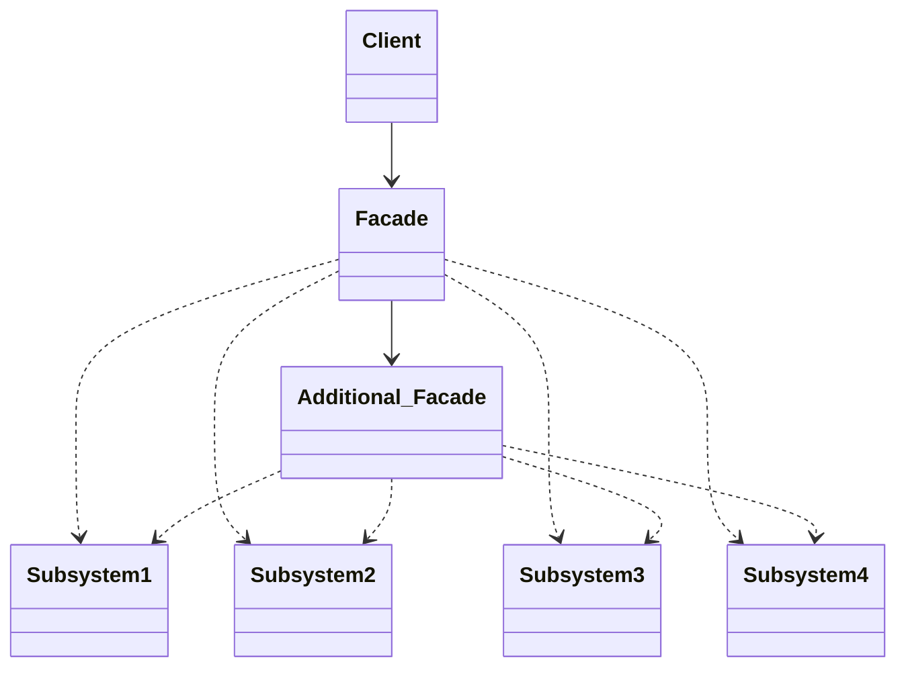
<details><summary></summary>
<div markdown="1">
- Facade : 복잡한 시스템에 대하여 단순한 인터페이스를 제공함으로써 사용자의 시스템 간 또는 여타 시스템과의 결합도를 낮추어 시스템 구조에 대한 파악을 쉽게 하는 패턴으로 오류에 대해서 단위별로 확인할 수 있게 하며, 사용자의 측면에서 단순한 인터페이스 제공을 통해 접근성을 높일 수 있는 디자인 패턴통합된 인터페이스 제공
</div></details>

4)`Flyweight`: 대량의 작은 객체들을 공유하는 패턴
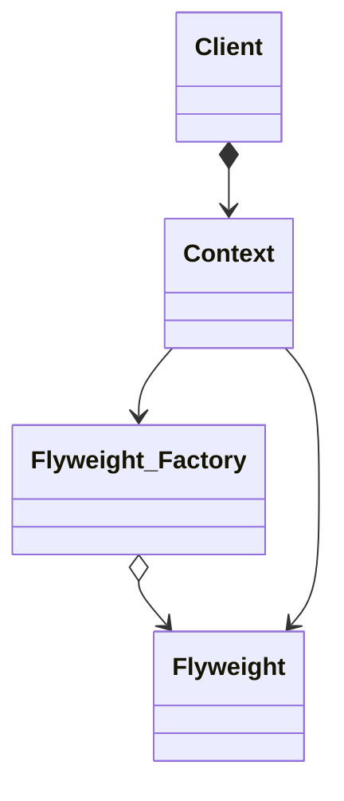
<details><summary></summary>
<div markdown="1">
- Flyweight : 다수의 객체로 생성될 경우 모두가 갖는 본질적인 요소를 클래스 화하여 공유함으로써 메모리를 절약하고, '클래스의 경량화'를 목적으로 하는 디자인 패턴여러 개의 '가상 인스턴스'를 제공하여 메모리 절감
</div></details>

5)`Proxy`: 대리인이 대신 그 일을 처리하는 패턴
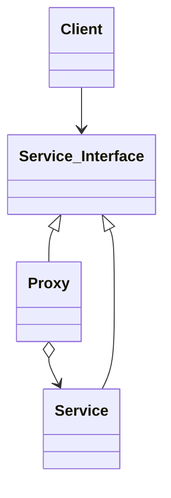
<details><summary></summary>
<div markdown="1">
- Proxy : '실체 객체에 대한 대리 객체'로 실체 객체에 대한 접근 이전에 필요한 행동을 취할 수 있게 만들며, 이 점을 이용해서 미리 할당하지 않아도 상관없는 것들을 실제 이용할 떄 할당하게 하여 메모리 용량을 아낄 수 있으며, 실체 객체를 드러나지 않게 하여 정보은닉의 역할도 수행하는 디자인 패턴특정 객체로의 접근을 제어하기 위한 용도로 사용
</div></details>


## 🚩**행위 패턴**  
1)`Interpreter`: 언어 규칙 클래스를 이용하는 패턴
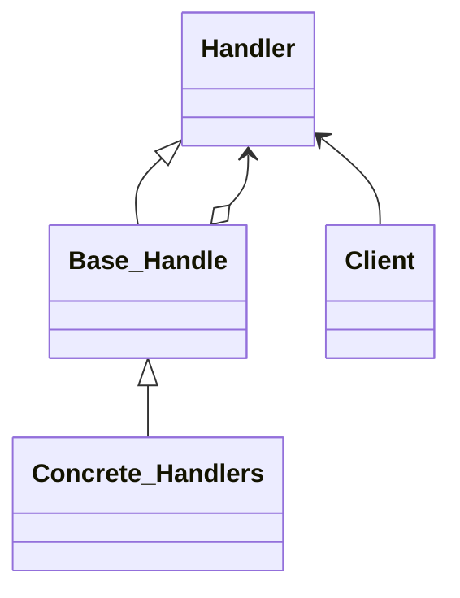
<details><summary></summary>
<div markdown="1">
- Interpreter : 언어의 다양한 해석, 구체적으로 구문을 나누고 그 분리된 구문의 해석을 맡는 클래스를 각각 작성하여 여러 형태의 언어 구문을 해석할 수 있게 만드는 디자인 패턴문법 자체를 캡슐화하여 사용
</div></details>

2)`Template Method`: 알고리즘 골격의 구조를 정의한 패턴
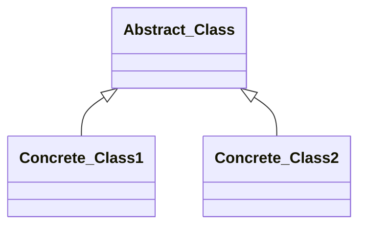
<details><summary></summary>
<div markdown="1">
- Template Method : 어떤 작업을 처리하는 일부분을 서브 클래스로 캡슐화해서 전체 일을 수행하는 구조는 바꾸지 않으면서 특정 단계에서 수행하는 내역을 바꾸는 패턴으로 일반적으로 상위클래스(추상 클래스)에는 추상메서드를 통해 기능을 골격을 제공하고, 하위 클래스(구체 클래스)의 메서드에는 세부 처리를 구체화하는 방식으로 사용하며 코드 양을 줄이고 유지보수를 용이하게 만드는 특징을 갖는 디자인 패턴상위 작업의 구조를 바꾸지 않으면서 서브 클래스로 작업의 일부분을 수행
</div></details>

3)`Chain of Responsibility`: 객체들끼리 연결 고리를 만들어 내부적으로 전달하는 패턴
```mermaid
classDiagram
Client  Handler
Handler

Handler
Base_Handler 
Concrete_Handlers
Client
 <|-- 
 ..> 
```
<details><summary></summary>
<div markdown="1">
- Chain of Responsibility : 정적으로 어떤 기능에 대한 처리의 연결이 하드코딩 되어 있을 때 기능 처리의 연결 변경이 불가능한데, 이를 동적으로 연결되어 있는 경우에 따라 다르게 처리될 수 있도록 연결한 디자인 패턴한 요청을 2개 이상의 객체에서 처리
</div></details>

4)`Command`: 요청 자체를 캡슐화하여 파라미터로 넘기는 패턴
```mermaid
classDiagram
 <|-- 
 ..> 
```
<details><summary></summary>
<div markdown="1">
- Command : 실행될 기능을 캡슐화함으로써 주어진 여러 기능을 실행할 수 있는 재사용성이 높은 클래스를 설계하는 패턴으로 하나의 추상 클래스에 메서드를 만들어 각 명령이 들어오면 그에 맞는 서브 클래스가 선택되어 실행되는 특징을 갖는 디자인 패턴요구사항을 객체로 캡슐화
</div></details>

5)`Iterator`: 내부 표현은 보여주지 않고 순회하는 패턴
```mermaid
classDiagram
 <|-- 
 ..> 
```
<details><summary></summary>
<div markdown="1">
- Iterator : 컬렉션 구현 방법을 노출시키지 않으면서도 그 집합체 안에 들어있는 모든 항목에 접근할 방법을 제공하는 디자인 패턴내부구조를 노출하지 않고, 복잡 객체의 원소를 순차적으로 접근 가능하게 해주는 행위 패턴
</div></details>

6)`Mediator`: 객체 간 상호작용을 캡슐화한 패턴
```mermaid
classDiagram
 <|-- 
 ..> 
```
<details><summary></summary>
<div markdown="1">
- Mediator : 객체지향 설계에서 객체의 수가 너무 많아지면 서로 간 통신을 위해 복잡해져서 객체지향에서 가장 중요한 느스한 결합의 특성을 해칠 수 있기 때문에 이를 해결하는 방법으로 중간에 이를 통제하고 지시할 수 있는 역할을 하는 중재자를 두고, 중재자에게 모든 것을 요구하여 통신의 빈도수를 줄여 객체지향의 목표를 달성하게 해주는 디자인 패턴상호작용의 유연한 변경을 지원
</div></details>

7)`Memento`: 상태 값을 미리 저장해 두었다가 복구하는 패턴
```mermaid
classDiagram
 <|-- 
 ..> 
```
<details><summary></summary>
<div markdown="1">
- Memento : 클래스 설계 관점에서 객체의 정보를 저장할 필요가 있을 때 적용하는 디자인 패턴으로 Undo 기능을 개발할 때 사용하는 디자인 패턴객체를 이전 상태로 복구시켜야 하느누 경우, '작업취소(Undo)' 요청 기능
</div></details>

8)`Observer`: 상태가 변할 때 의존자들에게 알리고, 자동 업데이트하는 패턴
```mermaid
classDiagram
 <|-- 
 ..> 
```
<details><summary></summary>
<div markdown="1">
- Observer : 한 객체의 상태가 바뀌면 그 객체에 의존하는 다른 객체들에 연락이 가고 자동으로 내용이 갱신되는 방버으로 일대 다의 의존성을 가지며 상호작용하는 객체 사이에서는 가능하면 느슨하게 결합하는 디자인 패턴. 객체의 상태 변화에 따라 다른 객체의 상태도 연동, 일대다 의존
</div></details>

9)`State`: 객체 내부 상태에 따라서 행위를 변경하는 패턴
```mermaid
classDiagram
 <|-- 
 ..> 
```
<details><summary></summary>
<div markdown="1">
- State : 객체 상태를 캡슐화하여 클래스함으로써 그것을 참조하게 하는 방식으로 상태에 따라 다르게 처리할 수 있도록 행위 내용을 변경하여, 변경 시 원시코드의 수정을 최소화할 수 있고, 유지보수의 편의성도 갖는 디자인 패턴객체의 상태에 따라 행위 내용을 변경
</div></details>

10)`Strategy`: 다양한 알고리즘 캡슐화하여 알고리즘 대체가 가능하도록 한 패턴
```mermaid
classDiagram
 <|-- 
 ..> 
```
<details><summary></summary>
<div markdown="1">
- Strategy : 알고리즘 군을 정의하고(추상 클래스) 같은 알고리즘을 각각 하나의 클래스로 캡슐화한 다음, 필요할 때 서로 교환해서 사용할 수 있게 하는 패턴으로, 행위 클래스로 캡슐화해 동적으로 행위를 자유롭게 바꿀 수 있게 해주는 디자인 패턴행위 객체를 클래스로 캡슐화해 동적으로 행위를 자유롭게 변환
</div></details>

11)`Visitor`: 오퍼레이션을 별도의 클래스에 새롭게 정의한 패턴
```mermaid
classDiagram
Visitor <|.. Concrete_Visitor
Visitor ..> ElementA
Visitor ..> ElementB
Element <|.. ElementA
Element <|.. ElementB
Concrete_Visitor <.. Client
Visitor <.. Element
Element <.. Client
```
```mermaid
classDiagram
 <|-- 
 ..> 
```
<details><summary></summary>
<div markdown="1">
- Visitor : 각 클래스 데이터 구조로부터 처리 기능을 분리하여 별도의 클래스를 만들어 놓고 해당 클래스의 메서드가 각 클래스를 돌아다니며 특정 작업을 수행하도록 만드는 패턴으로, 객체의 구조는 변경하지 않으면서 기능만 따로 추가하거나 확장할 때 사용하는 디자인 패턴특정 구조를 이루는 복합 객체의 원소 특성에 따라 동작을 수행할 수 있도록 지원하는 행위
</div></details>

추상화 캡슐화 위임 변경가능 유연성

---

### 각 패턴별 설명 내용
-  Intent  
설계문제와 솔루션을 간략하게 설명합니다.
-  Motivation  
발생한 문제와 해당 패턴이 가능하게 하는 솔루션을 추가로 설명합니다.
- Structure of classes  
패턴의 각 부분과 어떻게 이루어져있고 서로 관련되어 있는지 보여줍니다.
- Applicability  
- Java Library  
해당 설계 패턴을 사용한 자바 라이브러리를 소개합니다.  
- Code example  
코드 예제를 사용하면 패턴이 내포하고있는 아이디어를 더 쉽게 파악할 수 있습니다.
- Releations with Other Patterns  
다른 패턴과 유사점 및 차이점 그리고 같이 쓰면 좋은 패턴들을 함께 살펴보면 헷갈리지않고 패턴의 의도를 더 잘 파악할 수 있습니다.

https://www.jetbrains.com/help/idea/markdown.html#preview
