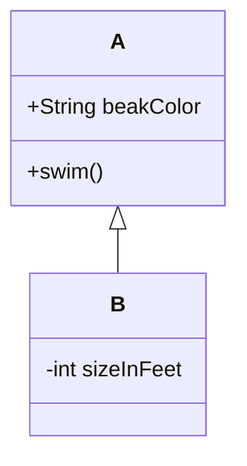

객체의 생성과정을 추상화함으로써 인스턴스화할 때 인터페이스와 구현을 연결하는 다른방법을 제시한다

🚩 **생성**   
1)`Builder`: 생산 단계를 캡슐화 하여 구축 공정을 동일하게 이용하도록 하는 패턴

Builder

- 복잡한 인스턴스를 조립하여 만드는 구조로, 복합 객체를 생성할 때 객체를 생성하는 방법(과정)과 객체를 구현(표현)하는 방법을 분리함으로써 동일한 생성 절차에서 서로 다른 표현 결과를 만들 수 있는 디자인 패턴생성과 표기를 분리해서 복잡한 객체를 생성
1. Builder
2. ConcreteBuilder
3. Director
4. Product

2)`Prototype`: 복사하여 새 개체를 생성할 수 있도록 하는 패턴

- Prototype : 처음부터 일반적인 원형을 만들어 놓고, 그것을 복사한 후 필요한 부분만 수정하여 사용하는 패턴으로, 생성할 객체의 원형을 제공하는 인스턴스에서 생성할 객체들의 타입이 결정되도록 설정하며 객체를 생성할 때 갖추어야 할 기본 형태가 있을 때 사용 되는 패턴기존 객체를 복제함으로써 객체를 생성

3)`Factory Method`: 객체를 생성하기 위한 인터페이스를 정의하여 어떤 클래스가 인스턴스화 될 것인지는 서브 클래스가 결정하도록 하는 패턴

Factory Method : 상위 클래스에서 객체를 생성하는 인터페이스를 정의하고, 하위 클래스에서 인스턴스를 생성하도록 하는 방식으로, 상위 클래스에서 인스턴스를 만드는 방법만 결정하고, 하위 클래스에서 그 데이터의 생성을 책임지고 조작하는 함수들을 오버로딩하여 인터페이스와 실제 객체를 생성하는 클래스를 분리할 수 있는 특성을 갖는 디자인 패턴생성할 객체의 클래스를 국한하지 않고 객체를 생성
1. Product
2. ConcreteProduct
3. Creator
4. ConcreteCreator

4)`Abstract Factory`: 생성군들을 하나의 모아놓고 팩토리 중에서 선택하게 하는 패턴

- Abstract Factory : 구체적인 클래스에 의존하지 않고 서로 연관되거나 의존적인 객체들의 조합을 만드는 인터페이스를 제공하는 패턴으로 이 패턴을 통해 생성된 클래스에서는 사용자에게 인터페이스(API)를 제공하고, 구체적인 구현은 Concrete Product 클래스에서 이루어지는 특징을 갖는 디자인 패턴동일한 주제의 다른 팩토리 묶음

1. AbstractProduct
2. ConcreteProduct
3. AbstractFactory
4. ConcreteFactory
5. Client

5)`Singleton`: 유일한 하나의 인스턴스를 보장하도록 하는 패턴

- Singleton : 전역 변수를 사용하지 않고 객체를 하나만 생성하도록 하며, 생성된 객체를 어디에서든지 참조할 수 있도록 하는 디자인 패턴한 클래스에 한 객체만 존재하도록 제한
1. Prototype
2. ConcretePrototype
3. Client

객체의 구조를 추상화 함으로써

🚩**구조**   
1)`Bridge`: 추상과 구현을 분리하여 결합도를 낮춘 패턴

- Bridge : 기능의 클래스 계층과 구현의 클래스 계층을 연결하고, 구현부에서 추상 계층을 분리하여 추상화된 부분과 실제 구현 부분을 독립적으로 확장할 수 있는 디자인 패턴구현뿐만 아니라, 추상화된 부분까지 변경해야 하는 경우 활용
1. Abstraction
2. Refined Abstraction
3. Implementor
4. Concrete Implementor

2)`Decorator`: 소스를 변경하지 않고 기능을 확장하도록 하는 패턴

- Decorator : 기존에 구현되어 있는 클래스에 필요한 기능을 추가해 나가는 설계 패턴으로 기능 확장이 필요할 때 객체 간의 결합을 통해 기능을 동적으로 유연하게 확장할 수 있게 해주어 상속의 대안으로 사용되는 디자인 패턴객체의 결합을 통해 기능을 동적으로 유연하게 확장

3)`Facade`: 하나의 인터페이스를 통해 느슨한 결합을 제공하는 패턴

- Facade : 복잡한 시스템에 대하여 단순한 인터페이스를 제공함으로써 사용자의 시스템 간 또는 여타 시스템과의 결합도를 낮추어 시스템 구조에 대한 파악을 쉽게 하는 패턴으로 오류에 대해서 단위별로 확인할 수 있게 하며, 사용자의 측면에서 단순한 인터페이스 제공을 통해 접근성을 높일 수 있는 디자인 패턴통합된 인터페이스 제공

4)`Flyweight`: 대량의 작은 객체들을 공유하는 패턴

- Flyweight : 다수의 객체로 생성될 경우 모두가 갖는 본질적인 요소를 클래스 화하여 공유함으로써 메모리를 절약하고, '클래스의 경량화'를 목적으로 하는 디자인 패턴여러 개의 '가상 인스턴스'를 제공하여 메모리 절감

5)`Proxy`: 대리인이 대신 그 일을 처리하는 패턴

- Proxy : '실체 객체에 대한 대리 객체'로 실체 객체에 대한 접근 이전에 필요한 행동을 취할 수 있게 만들며, 이 점을 이용해서 미리 할당하지 않아도 상관없는 것들을 실제 이용할 떄 할당하게 하여 메모리 용량을 아낄 수 있으며, 실체 객체를 드러나지 않게 하여 정보은닉의 역할도 수행하는 디자인 패턴특정 객체로의 접근을 제어하기 위한 용도로 사용

6)`Composite`: 개별 객체와 복합 객체를 클라이언트에서 동일하게 사용하도록 하는 패턴

- Composite : 객체들의 관계를 트리 구조로 구성하여 부분-전체 계층을 표현하는 패턴으로, 사용자가 단일 객체과 복합 객체 모두 동일하게 다루도록 하는 패턴복합 객체와 단일 객체를 동일하게 취급

7)`Adapter`: 인터페이스로 인해 함께 사용하지 못하는 클래스를 함께 사용하도록 하는 패턴

- Adapter : 기존에 생성된 클래스를 재사용할 수 있도록 중간에서 맞춰주는 역할을 하는 인터페이스를 만드는 패턴으로, 상속을 이용하는 클래스 패턴과 위임을 이용하는 인스턴스 패턴의 두 가지 형태로 사용되는 디자인 패턴인터페이스가 호환되지 않는 클래스들을 함께 이용할 수 있도록 타 클래스의 인터페이스를 기존 인터페이스에 덧씌움
1. Target
2. Client
3. Adaptee
4. Adapter

객체의 행위를 추상화(캡슐화)

🚩**행위**   
1)`Interpreter`: 언어 규칙 클래스를 이용하는 패턴

- Interpreter : 언어의 다양한 해석, 구체적으로 구문을 나누고 그 분리된 구문의 해석을 맡는 클래스를 각각 작성하여 여러 형태의 언어 구문을 해석할 수 있게 만드는 디자인 패턴문법 자체를 캡슐화하여 사용

2)`Template Method`: 알고리즘 골격의 구조를 정의한 패턴

- Template Method : 어떤 작업을 처리하는 일부분을 서브 클래스로 캡슐화해서 전체 일을 수행하는 구조는 바꾸지 않으면서 특정 단계에서 수행하는 내역을 바꾸는 패턴으로 일반적으로 상위클래스(추상 클래스)에는 추상메서드를 통해 기능을 골격을 제공하고, 하위 클래스(구체 클래스)의 메서드에는 세부 처리를 구체화하는 방식으로 사용하며 코드 양을 줄이고 유지보수를 용이하게 만드는 특징을 갖는 디자인 패턴상위 작업의 구조를 바꾸지 않으면서 서브 클래스로 작업의 일부분을 수행

3)`Chain of Responsibility`: 객체들끼리 연결 고리를 만들어 내부적으로 전달하는 패턴

- Chain of Responsibility : 정적으로 어떤 기능에 대한 처리의 연결이 하드코딩 되어 있을 때 기능 처리의 연결 변경이 불가능한데, 이를 동적으로 연결되어 있는 경우에 따라 다르게 처리될 수 있도록 연결한 디자인 패턴한 요청을 2개 이상의 객체에서 처리

4)`Command`: 요청 자체를 캡슐화하여 파라미터로 넘기는 패턴

- Command : 실행될 기능을 캡슐화함으로써 주어진 여러 기능을 실행할 수 있는 재사용성이 높은 클래스를 설계하는 패턴으로 하나의 추상 클래스에 메서드를 만들어 각 명령이 들어오면 그에 맞는 서브 클래스가 선택되어 실행되는 특징을 갖는 디자인 패턴요구사항을 객체로 캡슐화

5)`Iterator`: 내부 표현은 보여주지 않고 순회하는 패턴

- Iterator : 컬렉션 구현 방법을 노출시키지 않으면서도 그 집합체 안에 들어있는 모든 항목에 접근할 방법을 제공하는 디자인 패턴내부구조를 노출하지 않고, 복잡 객체의 원소를 순차적으로 접근 가능하게 해주는 행위 패턴

6)`Mediator`: 객체 간 상호작용을 캡슐화한 패턴

- Mediator : 객체지향 설계에서 객체의 수가 너무 많아지면 서로 간 통신을 위해 복잡해져서 객체지향에서 가장 중요한 느스한 결합의 특성을 해칠 수 있기 때문에 이를 해결하는 방법으로 중간에 이를 통제하고 지시할 수 있는 역할을 하는 중재자를 두고, 중재자에게 모든 것을 요구하여 통신의 빈도수를 줄여 객체지향의 목표를 달성하게 해주는 디자인 패턴상호작용의 유연한 변경을 지원

7)`Memento`: 상태 값을 미리 저장해 두었다가 복구하는 패턴

- Memento : 클래스 설계 관점에서 객체의 정보를 저장할 필요가 있을 때 적용하는 디자인 패턴으로 Undo 기능을 개발할 때 사용하는 디자인 패턴객체를 이전 상태로 복구시켜야 하느누 경우, '작업취소(Undo)' 요청 기능

8)`Observer`: 상태가 변할 때 의존자들에게 알리고, 자동 업데이트하는 패턴

- Observer : 한 객체의 상태가 바뀌면 그 객체에 의존하는 다른 객체들에 연락이 가고 자동으로 내용이 갱신되는 방버으로 일대 다의 의존성을 가지며 상호작용하는 객체 사이에서는 가능하면 느슨하게 결합하는 디자인 패턴. 객체의 상태 변화에 따라 다른 객체의 상태도 연동, 일대다 의존

9)`State`: 객체 내부 상태에 따라서 행위를 변경하는 패턴

- State : 객체 상태를 캡슐화하여 클래스함으로써 그것을 참조하게 하는 방식으로 상태에 따라 다르게 처리할 수 있도록 행위 내용을 변경하여, 변경 시 원시코드의 수정을 최소화할 수 있고, 유지보수의 편의성도 갖는 디자인 패턴객체의 상태에 따라 행위 내용을 변경

10)`Strategy`: 다양한 알고리즘 캡슐화하여 알고리즘 대체가 가능하도록 한 패턴

- Strategy : 알고리즘 군을 정의하고(추상 클래스) 같은 알고리즘을 각각 하나의 클래스로 캡슐화한 다음, 필요할 때 서로 교환해서 사용할 수 있게 하는 패턴으로, 행위 클래스로 캡슐화해 동적으로 행위를 자유롭게 바꿀 수 있게 해주는 디자인 패턴행위 객체를 클래스로 캡슐화해 동적으로 행위를 자유롭게 변환

11)`Visitor`: 오퍼레이션을 별도의 클래스에 새롭게 정의한 패턴

- Visitor : 각 클래스 데이터 구조로부터 처리 기능을 분리하여 별도의 클래스를 만들어 놓고 해당 클래스의 메서드가 각 클래스를 돌아다니며 특정 작업을 수행하도록 만드는 패턴으로, 객체의 구조는 변경하지 않으면서 기능만 따로 추가하거나 확장할 때 사용하는 디자인 패턴특정 구조를 이루는 복합 객체의 원소 특성에 따라 동작을 수행할 수 있도록 지원하는 행위

추상화 캡슐화 위임 변경가능 유연성

---
# Pattern Name

## Intent
>설계문제와 솔루션을 간략하게 설명합니다.
## Motivation
>발생한 문제와 해당 패턴이 가능하게 하는 솔루션을 추가로 설명합니다.
## Structure of classes
>패턴의 각 부분과 어떻게 이루어져있고 서로 관련되어 있는지 보여줍니다.

- A : 설명
- B : 설명
## Applicability
>
## Java Library
>해당 설계 패턴을 사용한 자바 라이브러리를 소개합니다.
## Code example
>코드 예제를 사용하면 패턴이 내포하고있는 아이디어를 더 쉽게 파악할 수 있습니다.
## Releations with Other Patterns
>다른 패턴과 유사점 및 차이점 그리고 같이 쓰면 좋은 패턴들을 함께 살펴보면 헷갈리지않고 패턴의 의도를 더 잘 파악할 수 있습니다.

https://www.jetbrains.com/help/idea/markdown.html#preview